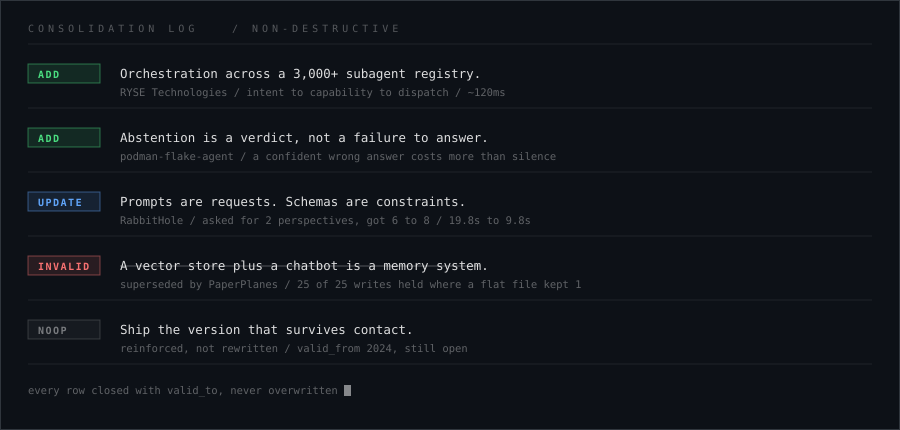

  

 

&nbsp;&nbsp;
&nbsp;&nbsp;

---

## I build memory systems, agentic workflows, and interfaces that feel a little alive.

Hi, I am **Somay Kousis**. I also go by **Blink**.

CS student at **ABV-IIITM Gwalior**. Currently **AI Systems Engineer Intern at RYSE Technologies**, where I built the orchestrator routing tasks across a registry of 3,000+ specialized subagents. Also **co-founder and CEO of Something**, a founder and investor matching layer built on verified proof of work rather than network access.

The thing I keep coming back to: most systems are built to work once, in the demo, on the happy path. I am more interested in the version that holds up afterwards. Under contention. Under a rate limit. After the fact it recorded last month turns out to be wrong.

That preference shows up in the code before it shows up in anything I say about it. Two of my projects independently converged on the same write path, and I did not plan that.

 

---

  

---

## Proof Of Work

Ordered by how much of it survives inspection, not by how recent it is.

### [PaperPlanes](https://github.com/Somay-kousis/PaperPlanes)

A research companion on a **CockroachDB memory substrate** with bi-temporal fact versioning, so a superseded claim is closed with `valid_to` and stays auditable instead of being overwritten. Not a vector store bolted to a chatbot.

Every claim ships a reproduction command:

| Claim | Result | Baseline |
|---|---|---|
| 25 concurrent writers, one counter | **25 / 25 held**, 58 SERIALIZABLE conflicts auto-retried | flat file kept **1**, silently lost 24 |
| ANN over ~10,000 notes | **~15ms** C-SPANN vector search | O(n) full scan |
| Live DB restart mid-conversation | next turn returns **200** | history gone |

There is a test in there asserting the decision model is real Nova and not stubbed, because mocks agree with you and a real cluster does not.

### [podman-flake-agent](https://github.com/Somay-kousis/podman-flake-agent)

Prototype for the **LFX Mentorship on agentic CI flake categorization**. Podman's migration off Cirrus orphaned `logformatter`, the 38KB Perl script that used to classify every subtest, so triage fell back to a human reading a bar graph.

The hard parts were not calling a model on a log:

- **Ground truth had to be mined.** The project never auto-reruns failing tests, so "failed then passed" is not handed to you. Three weighted proxy signals stand in.
- **Cost is an architecture decision.** 30+ jobs per PR, each with a full journal. Extracting only the failing block cuts payload **76% to 93%** before inference.
- **A confident wrong answer is worse than no tool.** Call a real race condition an infra blip and you have told a maintainer to press re-run on a genuine bug. `unknown` is a first-class verdict.

Standard library only. Clone it and run the whole eval with no token and no API budget.

### [RabbitHole](https://github.com/Somay-kousis/RabbitHole)

A LangGraph courtroom over a real legal corpus. Asked politely for 2 perspectives, it generated 6 to 8, a 3 to 4x overrun that burned Groq's token-per-minute ceiling before the debate resolved. No amount of prompt rewording fixed it.

Moving perspective count into a **state schema the moderator schedules against** fixed it completely. Mean time to verdict went from **19.8s to 9.8s**. Retrieval is Pinecone dense plus a BM25 sparse encoder, Jina reranking on top, and a three-way CRAG route: good chunks synthesize locally, bad chunks fall back to web search, ambiguous chunks run both in parallel.

### [Something](https://github.com/Somay-kousis/Something)

Co-founded. Team formation and capital discovery are the same failure wearing two costumes, and nobody had built one system closing both. Existing platforms either gate on post-traction signals a pre-seed founder cannot produce, or apply no verification at all and drown both sides in noise.

Something gates on proof that exists **before** revenue: prototype, pilot, patent, press. **573-person waitlist in the first month, zero paid distribution.** I own frontend, AI architecture, and go-to-market.

### [Co-op Purchase Coordinator](https://github.com/Somay-kousis/Co-op-Purchase-Coordinator)

When autonomous agents buy from shared sellers they collide, bid against each other, and waste rounds under a seller's hidden floor. This resolves each collision with the mechanism that actually fits it instead of one generic rule.

Second-price auction flooring the winning bid at the seller's reservation price. Shapley-inspired coalition discounts scaling 5% at two buyers to 20% at four. Binary search converges on a seller's price in about **7 rounds**. 46 tests, including concurrency and 3 regression bugs.

### [Co-Founder Memory](https://github.com/Somay-kousis/Co-Founder-Memory)

A **19-node stateful LangGraph** separating live conversational memory extraction, critique-driven planning loops, and an automated nightly dossier pipeline. Backed by Supabase pgvector with HNSW indexing. A daily catch-up scheduler reconstructs project momentum by correlating engineering logs, GitHub activity, and targeted search, looping an auto-reviewer back to search until the dossier passes.

### [Portfolio](https://github.com/Somay-kousis/Portfolio)

Part website, part environment. Every number on it links to the repository that proves it, which is the only design constraint that actually mattered.

---

<strong>Smaller Experiments</strong> (click to expand)

 

- [Oeuvre](https://github.com/Somay-kousis/Oeuvre): a portfolio RAG system over personal memory, including the contradictions.
- [The Last Library](https://github.com/Somay-kousis/The-Last-Library): small RAG mystery project built while learning retrieval.
- [SteelCareer](https://github.com/Somay-kousis/SteelCareer): multi-role hiring platform shipped to a real client. Human introductions, not algorithmic matching.
- [Customer Churn Prediction](https://github.com/Somay-kousis/Customer-Churn): churn risk and classification.
- [House Price Prediction System](https://github.com/Somay-kousis/House-Price-Prediction-System): my first ML project, kept here on purpose.

---

## Stack I Am Actually Using

**AI / Backend**

**Data / Memory**

**Frontend / Product**

**Tools / Infra**

---

## Elsewhere On The Record

<!-- Hornet faces LEFT, so she sits on the RIGHT, looking back toward the text -->

- **Smart India Hackathon 2025**, 6th nationally, leading a team of 6.
- **Hacksagon 2024**, 2nd place, Hardware Track.
- **MCP: Build Rich-Context AI Apps**, Anthropic.
- **Published writer**, CAMA Magazine (Canada). Poetry, performed to audiences of 350+.

Teaching math, English, and life skills to underprivileged children most weeks with the SGM social initiative. Ran logistics for a 1000+ attendee fest. The writing and the systems work are the same skill: breaking a complex thing down until nothing is left vague.

### Still Getting Wrong

- Finishing one strong project instead of starting five interesting ones. The list above is evidence both ways.
- DSA consistency, mostly so it stops being the thing that trips me up in interviews.
- Writing the limitations section before someone else finds it for me.

 

---

## Links

---

<!-- demolab is the maintained domain for streak-stats; the old herokuapp host is
     unmaintained. github-readme-stats.vercel.app is DEPLOYMENT_PAUSED, so the
     stats and top-langs cards are replaced by the activity graph until it is
     either self-hosted or comes back. -->

 
<code>valid_from 2024. no row here has been overwritten, only closed.</code>

