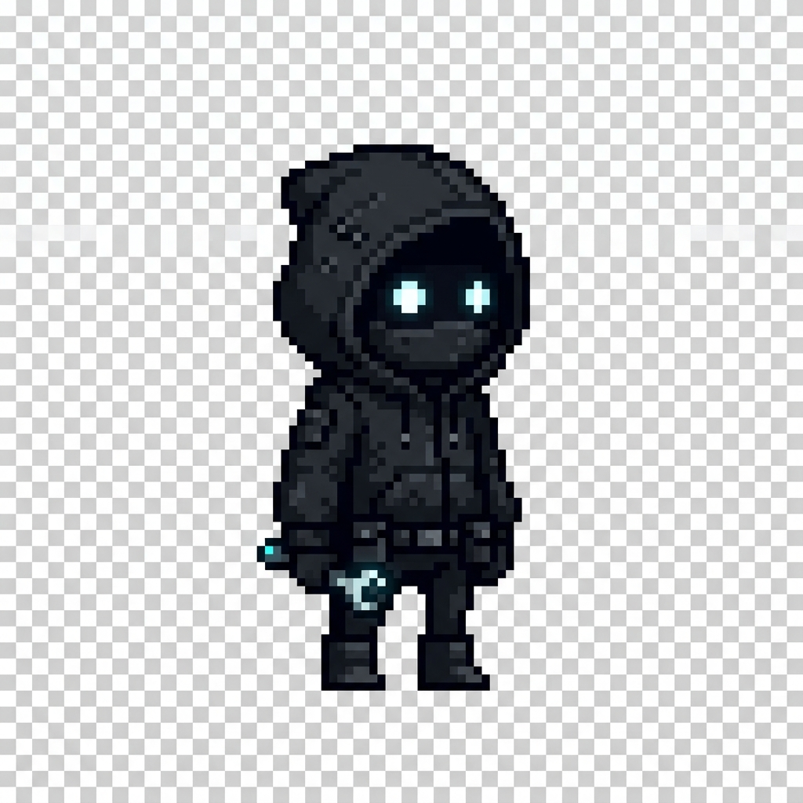

  

 

  &nbsp;&nbsp;
  &nbsp;&nbsp;
  

---

 

## 👤 Who Am I?

<table>
  <tr>
    <td width="200" align="center" valign="top">
      
    </td>
    <td valign="top" style="padding-left: 20px;">
      

        I'm a <strong>Frontend Developer & ML Engineer</strong> studying at <strong>ABV-IIITM Gwalior</strong>. My journey into tech started early — I was always obsessed with the intersection of design and technology, the idea that code could look and feel like art.
      

      

        At 18, I dived deep into the frontend world, fell in love with creating interfaces that feel human. From fluid onboarding experiences (<em>Zuuush</em>) to wizarding-world luggage systems (<em>Hogwarts_Luggage</em>), every project is a chance to push what the browser can do.
      

      

        On the other side, I architect ML pipelines — customer churn models, house price prediction systems — because I believe the best products are those that not only look alive but <em>think</em> alive. My true edge? Bridging both worlds.
      

    </td>
  </tr>
</table>

 

---

## 🔗 A Little More About Me

<table>
  <tr>
    <td valign="top" width="60%">
      <ul>
        <li>I love being surrounded by people who challenge me to grow.</li>
        <li>☑ Currently building <strong>@ Mutiny</strong> — a dev collaboration ecosystem.</li>
        <li>If you want to learn about Frontend / ML, I'm always down to talk.</li>
        <li>☑ Interested in any large-scale project that makes me think hard.</li>
        <li>Lover of minimalism and brutalist design.</li>
      </ul>
       
      
      
      
    </td>
    <td valign="top" align="center" width="40%">
      
    </td>
  </tr>
</table>

 

---

## 📊 GitHub Status

  
  &nbsp;
  

 

---

## 🛠 My Stacks

  
    
  
    
  

 

---

## 📌 My Best Repositories

  
  

   

  
  

   

  
  

 

  ⚡ Building things that feel alive — Somay Kousis

