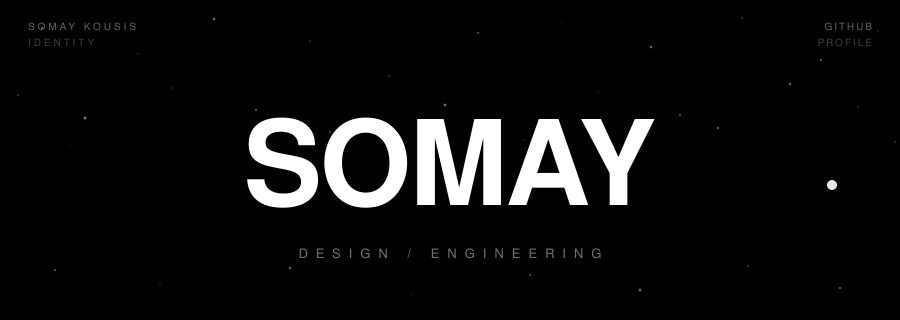
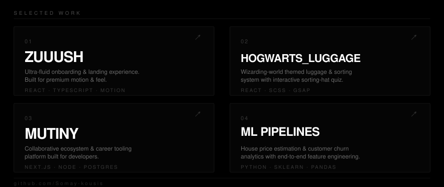

<div align="center">

<!-- Retro-Synthwave 3D Banner -->


<br/>

<!-- Cybernetic Greeting / Role Subtext -->
<h3>⚡ Hi there, I'm Somay Kousis — also known as <b>Blink</b> in the digital space.</h3>
<p>
  <i>I craft immersive, human-first interfaces and architect neural networks to solve real-world problems.</i>
</p>

<!-- Social Badges -->
<a href="https://github.com/Somay-kousis"></a>
<a href="https://linkedin.com/in/somay-kousis-630ab1313"></a>
<a href="https://x.com/somaykousis"></a>

<br/><br/>

<!-- Terminal Diagnostics Widget -->


</div>

<br/>

## ⚔️ Systems & Repositories

Below is a visual terminal dashboard of my primary projects. Click on the dashboard to view my full repository list, or select individual nodes below:

<div align="center">
  <a href="https://github.com/Somay-kousis?tab=repositories">
    
  </a>
</div>

<br/>

*   **[⚡ Zuuush](https://github.com/Somay-kousis/Zuuush.git)** — An onboarding and landing platform focusing on ultra-fluid micro-motions and frontend responsiveness.
*   **[🧙‍♂️ Hogwarts Luggage](https://github.com/Somay-kousis/Hogwarts_Luggage.git)** — A wizarding-world themed Luggage & Inventory management application featuring quiz-based sorting hat features.
*   **[🏴‍☠️ Mutiny](https://github.com/Somay-kousis/Mutiny)** & **[💼 SteelCareer](https://github.com/Somay-kousis/SteelCareer)** — Development tool ecosystems and career automation frameworks built for developers.
*   **[🏡 House Price Prediction](https://github.com/Somay-kousis/House-Price-Prediction-System.git)** — An end-to-end Machine Learning pipeline utilizing regression models to analyze market variables and estimate properties values.
*   **[📊 Customer Churn Engine](https://github.com/Somay-kousis/Customer-Churn.git)** — A classifier analytics model designed to highlight churn vectors and predict client retention metrics.
*   **[🌐 Interactive Portfolio](https://github.com/Somay-kousis/Portfolio.git)** — My personal vector corner on the web displaying works and UI iterations.

<br/>

---

## 🛠️ Diagnostics & Technologies

```yaml
Frontend Stack:
  Frameworks: [React.js, Next.js, Redux]
  Languages: [TypeScript, JavaScript (ES6+), HTML5, SCSS]
  Design: [TailwindCSS, Vanilla CSS, Framer Motion, GSAP]

Applied Intelligence:
  Languages: [Python, R, SQL]
  Libraries: [Scikit-Learn, Pandas, NumPy, Matplotlib, TensorFlow]
  Core Focus: [Feature Engineering, Classification, Regression Analysis]
```

<br/>

---

## 👽 The Developer Reality Check (Meme Decryptor)

Feel free to expand the nodes below to reveal the actual background logic of my day-to-day coding sessions.

<details>
<summary><b>🔥 Centering a Div</b></summary>
<p>
  <blockquote>
    "I have centered thousands of divs. Yet, every single time I write <code>align-items: center</code>, I hold my breath and pray to the CSS layout gods."
  </blockquote>
</p>
</details>

<details>
<summary><b>📦 Git Commit Messages</b></summary>
<p>
  <ul>
    <li><code>git commit -m "Refactor utility module"</code> (Initial clean commit)</li>
    <li><code>git commit -m "fix syntax error"</code> (Oops)</li>
    <li><code>git commit -m "minor edit"</code> (Still failing)</li>
    <li><code>git commit -m "PLEASE COMPILE"</code> (Acceptance stage)</li>
    <li><code>git commit -m "it works now, don't touch it"</code> (Success!)</li>
  </ul>
</p>
</details>

<details>
<summary><b>☕ Coffee Conversion Law</b></summary>
<p>
  <blockquote>
    A mathematician is a device for turning coffee into theorems. A developer is a machine for converting caffeine into functional features, complex UI transitions, and unresolved console warnings.
  </blockquote>
</p>
</details>

<details>
<summary><b>🐛 Bug Management Strategy</b></summary>
<p>
  <pre>
1. It doesn't compile. (Weep)
2. It compiles but crashes immediately. (Panic)
3. It compiles and works, but I don't know why. (Deep existential terror)
  </pre>
</p>
</details>

<br/>

<div align="center">
  <p opacity="0.5"><i>System node compiled successfully on 2026-05-20. Initiating sleep state... Zzz</i></p>
</div>
