

  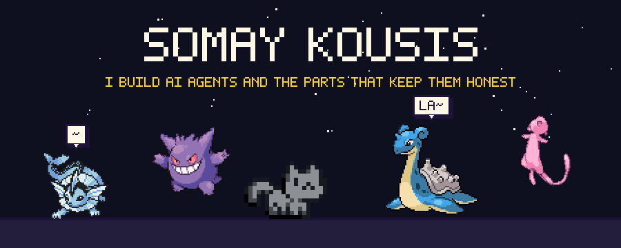

  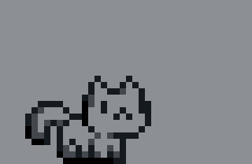
  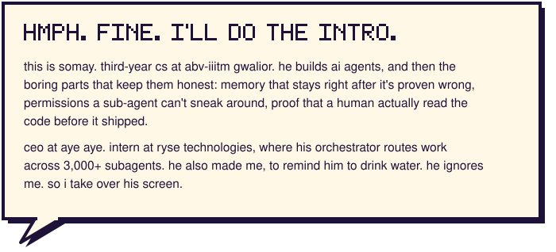

  <a href="https://ayeayecaptain.vercel.app">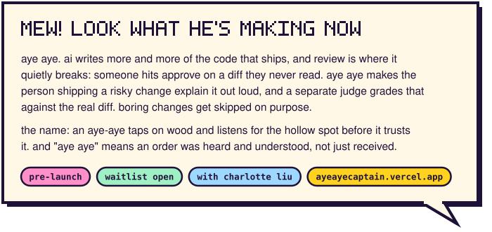</a>
  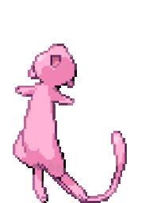

  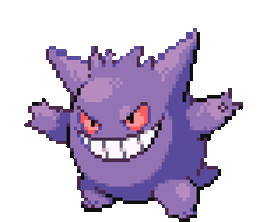
  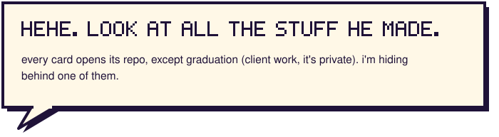

  <a href="https://github.com/Somay-kousis/PaperPlanes">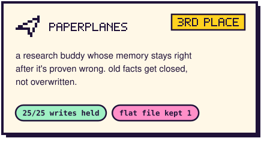</a>
  <a href="https://github.com/Somay-kousis/Pocket-Change">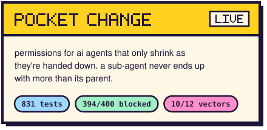</a>
  <a href="https://github.com/Somay-kousis/Apocalypse">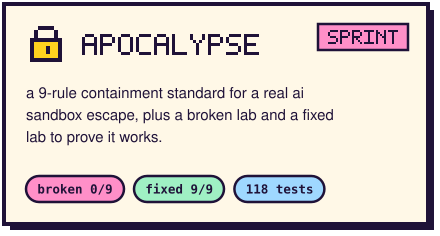</a>
  <a href="https://github.com/Somay-kousis/podman-flake-agent">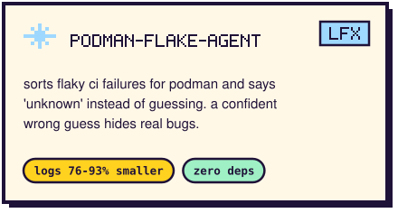</a>
  <a href="https://github.com/Somay-kousis/Perceived-Oversight">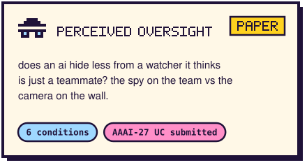</a>
  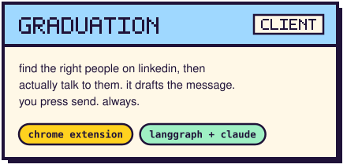
  <a href="https://github.com/Somay-kousis/RabbitHole">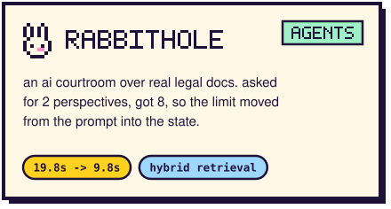</a>
  <a href="https://github.com/Somay-kousis/Co-op-Purchase-Coordinator">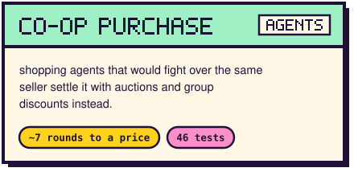</a>
  <a href="https://github.com/Somay-kousis/Co-Founder-Memory">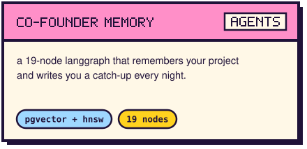</a>
  <a href="https://github.com/Somay-kousis/pixels">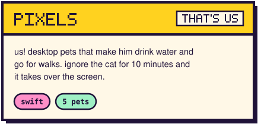</a>
  <a href="https://github.com/SomethingDuality/Somethingv1">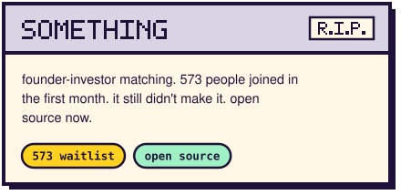</a>
  <a href="https://github.com/Somay-kousis/Portfolio">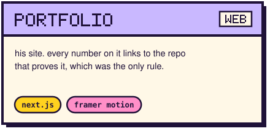</a>

  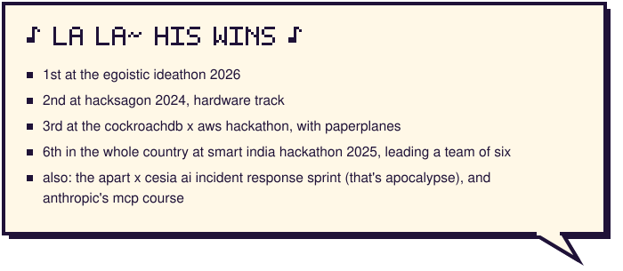
  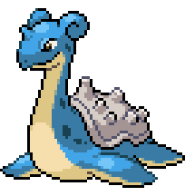

  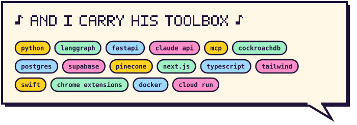

  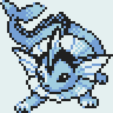
  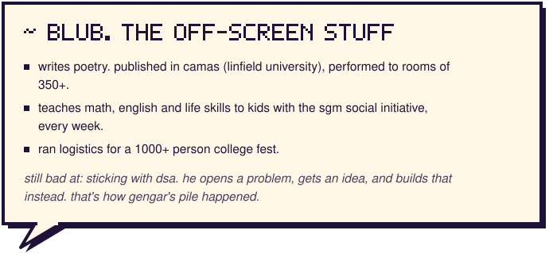

  
  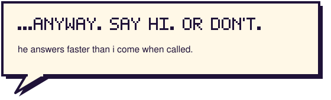

  <a href="https://ayeayecaptain.vercel.app">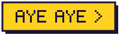</a>
  <a href="https://portfolio-sable-psi-56.vercel.app">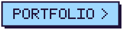</a>
  <a href="https://linkedin.com/in/somay-kousis-630ab1313">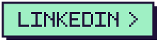</a>
  <a href="https://x.com/somaykousis">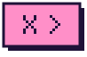</a>

 

  <picture>
    <source media="(prefers-color-scheme: dark)" srcset="https://raw.githubusercontent.com/Somay-kousis/Somay-kousis/output/pixel-pets-dark.svg">
    <source media="(prefers-color-scheme: light)" srcset="https://raw.githubusercontent.com/Somay-kousis/Somay-kousis/output/pixel-pets-light.svg">
    
  </picture>
   
  mew, the cat and gengar eat a year of my commits every 26 seconds. they grow back.
   
  the pets live in <a href="https://github.com/Somay-kousis/pixels">pixels</a>. the pokémon are © nintendo / game freak, the cat belongs to its artist. i just gave them jobs.

