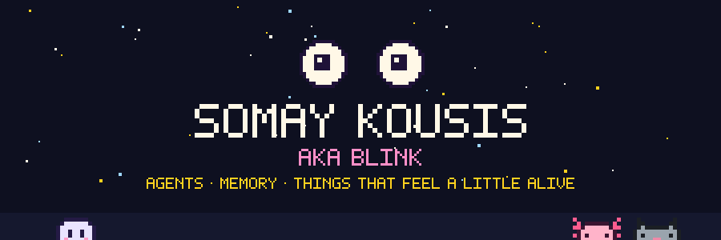
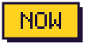
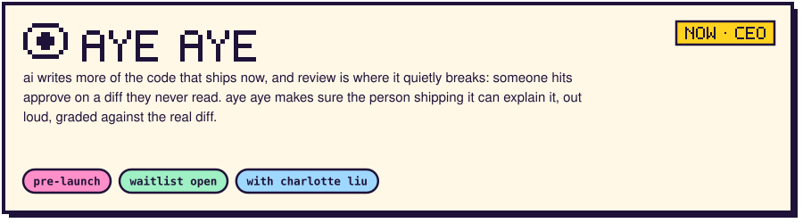
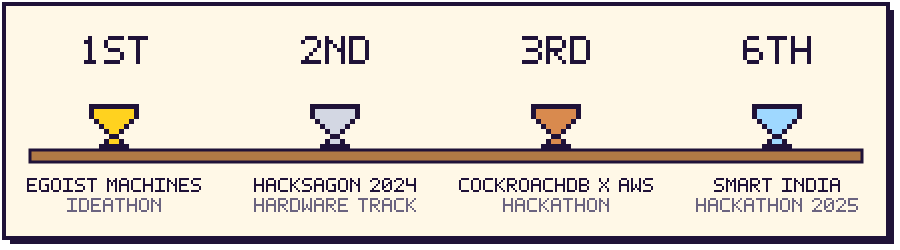
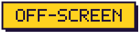
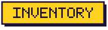
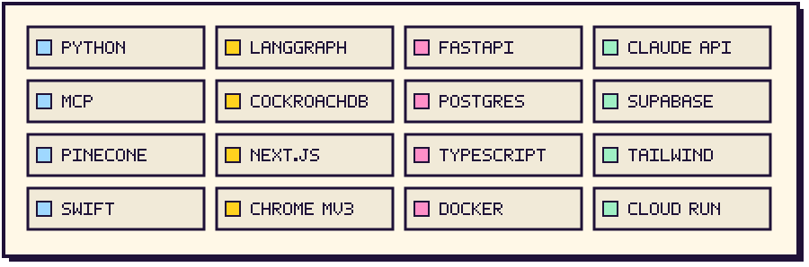

  

hey, i'm **somay**. most people call me **blink**.

i build ai agents, and then the boring parts that keep them honest: memory that stays right after it's proven wrong, permissions a sub-agent can't sneak around, a check that the human actually read the diff before shipping it. third year cs at abv-iiitm gwalior. ceo at aye aye. intern at ryse technologies, where my orchestrator routes work across 3,000+ subagents.

i also write poetry, teach kids most weekends, and recently built desktop pets that guilt-trip me into drinking water. so. range.

 

the name does two jobs. an aye-aye finds food by tapping on wood and listening for the hollow spot, it doesn't trust the surface. and "aye aye" is what a crew says when an order was heard *and* understood. no numbers here yet, the code isn't public. when it is, they'll come with the commands that prove them.

 

  
  
  
  
  
  
  
  
  
  
  
  

every card links to its repo, except graduation, which is client work. the stuff that didn't make the cut is in [repositories](https://github.com/Somay-kousis?tab=repositories), including my first ml project, which i keep around on purpose.

 

plus an entry in the apart x cesia ai incident response sprint (that's apocalypse), and anthropic's mcp course.

 

- published in **cama magazine** (canada). poetry, performed to rooms of 350+.
- teaching math, english, and life skills with the sgm social initiative, most weeks.
- ran logistics for a 1000+ person college fest.
- **7,000+ people** follow my writing on dev.to.

things i'm still bad at: finishing one thing before starting five more (see above), dsa consistency, and writing the limitations section before someone else finds it for me.

 

 

  
  
  
  

 

  <picture>
    <source media="(prefers-color-scheme: dark)" srcset="https://raw.githubusercontent.com/Somay-kousis/Somay-kousis/output/pixel-pets-dark.svg">
    <source media="(prefers-color-scheme: light)" srcset="https://raw.githubusercontent.com/Somay-kousis/Somay-kousis/output/pixel-pets-light.svg">
    
  </picture>
   
  a ghost, a cat, and an axolotl eat a year of my commits every 26 seconds. they grow back.

